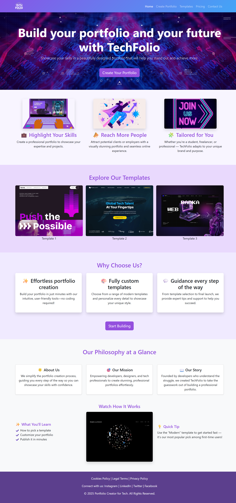
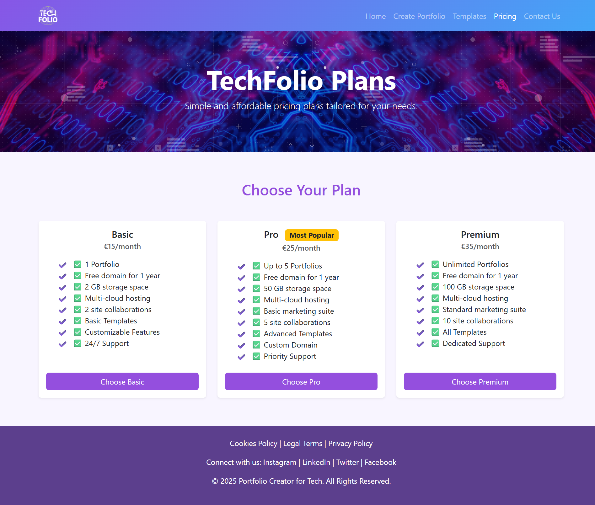

# 🌐 TechFolio — Portfolio Builder Website


A responsive and modern **portfolio builder web application** that allows users to **create, customize, and manage their personal portfolios** with ease.  
Developed as part of my Web Development project, TechFolio blends simplicity, interactivity, and functionality — empowering users to build their online presence in just a few clicks.

---

## ✨ Features
- User registration, login, and session management (PHP + MySQL)
- Dynamic templates with **Bootstrap 5**
- Client-side form validation and animations using **JavaScript**
- Admin dashboard with user and content management
- Soft UI-inspired design with a purple–blue gradient theme
- Responsive layout for mobile, tablet, and desktop
  
[](https://drive.google.com/file/d/1kqSSC4sZumSeO_iM9dlEhZljMQhxNTbv/view)

---

## 🧩 Technologies
| Tool | Purpose |
|------|----------|
| **PHP** | Backend scripting and authentication |
| **JavaScript (ES6)** | Validation, UI interactivity, and dynamic effects |
| **MySQL** | Database management |
| **Bootstrap 5** | Frontend design and responsive layout |
| **HTML5 / CSS3** | Core structure and styling |
| **XAMPP** | Local development environment |

---

## 🚀 How to Run Locally

1. **Install XAMPP** and start Apache & MySQL  
2. Clone this repository:
   ```bash
   git clone https://github.com/egshiglen-henny/techfolio-website.git
   ```
3. Move the project folder into your htdocs/ directory:
   C:\xampp\htdocs\techfolio-website
4. Import the database file using phpMyAdmin
5. Open your browser and navigate to:
   http://localhost/techfolio-website/home.php

---
## 📸 Screenshots

### 🏠 Homepage  


### 🎨 Template Gallery  


### ✍️ Create Portfolio Page  


### 💰 Pricing Plans  


### 📞 Contact Page  


---

## 💻 Project Structure
  ```
  techfolio/
  ├── blog/
  ├── features/
  ├── layout/
  ├── templates/
  ├── admin.php
  ├── confirm_email.php
  ├── contact.php
  ├── create.php
  ├── database.php
  ├── home.php
  ├── login.php
  ├── logout.php
  ├── main.php
  ├── pricing.php
  ├── process_login.php
  ├── process_register.php
  ├── register.php
  ├── resend_verification.php
  ├── script.js
  ├── settings.php
  ├── styles.css
  ├── templates.php
  ├── update_theme.php
  ├── users.php
  ├── README.md
  ├── admin1.jpg
  ├── background.jpeg
  ├── tech.jpg
  ├── tech.png
  └── aboutus.mp4
  ```

---

## 👩‍💻 Author
**Egshiglen Enkhbayar**  
📍 Dublin, Ireland  
🔗 [GitHub](https://github.com/egshiglen-henny) | [LinkedIn](https://linkedin.com/in/egshiglene)

---

